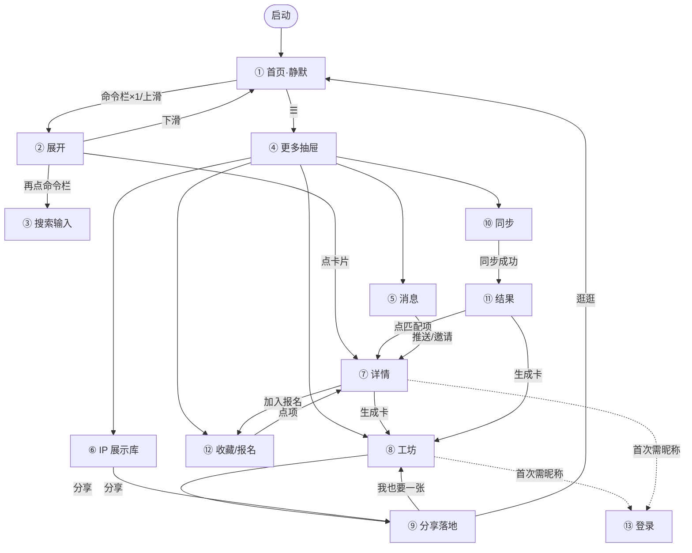

# HackerTrip 小程序 · 设计规范 design.md（生产级）

> 视觉语言：**Claude / Anthropic 暖调**（奶油纸感 + 黏土橙 + 衬线大标题 + 极简留白）。
> 交互规范：**微信小程序标准**（自定义导航避让胶囊、44pt 触控、安全区、page-container 抽屉/弹层）；缺标准处参照 **Apple HIG**。
> Figma 设计稿：https://www.figma.com/design/FL9PioBRU82uD86pajjt6p ｜ 视觉细则见 [style.md](./style.md)。

## 设计理念
安静、人文、内容优先。首屏只给品牌 + 问候 + 一个命令栏，把"发现"做成一次轻动作；信息按需展开，靠暖色留白与层级让黑客松一眼可读。拒绝通用 AI 紫渐变与炫光。

## 页面清单（13）与路由
| # | 页面 | 路由 | 类型 |
|---|------|------|------|
| ① | 首页·静默态 | `pages/index`（默认） | tabBar 首页 |
| ② | 首页·展开态 | `pages/index`（展开） | 同页状态 |
| ③ | 首页·搜索态 | `pages/index`（输入） | 同页状态 |
| ④ | 更多抽屉 | `page-container` 覆盖层 | 抽屉 |
| ⑤ | Recent 消息中心 | `pages/recent` | 普通页 |
| ⑥ | 个人 IP 展示库 | `pages/profile`（或 `u/[username]`） | 普通页 |
| ⑦ | 黑客松详情 | `pages/detail?id=` | 普通页 |
| ⑧ | 身份卡工坊 | `pages/card` | 普通页（canvas） |
| ⑨ | 卡片分享落地 | `pages/share?role=&variant=` | 普通页 |
| ⑩ | Skills 同步 | `pages/sync` | 普通页 |
| ⑪ | 黑客松匹配结果 | `pages/result` | 普通页 |
| ⑫ | 收藏 / 报名清单 | `pages/profile`（清单 tab） | 普通页 |
| ⑬ | 登录 / 授权 | 授权弹层 | 弹层 |

## 跳转链路（Navigation Graph）

## 每页 · 入口 / 跳转 / 排版 / 微信规范
> 完整一页一卡的备注见渲染图 `docs/flow-spec.png`，下面给关键约束。

- **① 静默态**：命令栏 88h/圆角24/距底 30+安全区；右上 88px 胶囊安全区禁放按钮。点☰→④，命令栏×1 或上滑→②。
- **② 展开态**：scroll-view 惯性 + grab 条；卡片 361w/圆角18/内距16/间距16。命令栏×2→③，卡片→⑦，下滑→①。
- **③ 搜索态**：input focus 自动弹键盘（adjust-position），clay 2px 聚焦描边；最近/热门 chip。回车→结果。
- **④ 更多抽屉**：`page-container` 实现，遮罩/左滑关闭；导航行 54h（触控≥44）。各项分别跳 ⑧/⑩/⑫/⑤/⑥。
- **⑤ Recent**：消息行 92h；推送依赖 `requestSubscribeMessage`。邀请→资料、推送→⑦、更新→详情。
- **⑥ IP 展示库**：`onShareAppMessage` + `onShareTimeline`；canvas 出图。分享→⑨、编辑→⑧。
- **⑦ 详情**：`navigateTo` 带 id；底栏吸底+安全区。加入报名→⑫、生成卡→⑧、复制官网→剪贴板。
- **⑧ 工坊**：canvas `type="2d"`，`canvasToTempFilePath` + `saveImageToPhotosAlbum`（需授权，失败引导 openSetting）。分享→⑨。
- **⑨ 分享落地**：被分享者先看内容不强登录；scene 统计裂变。我也要一张→⑧。
- **⑩ 同步**：云函数 `pairSync` 凭配对码拉取（30 分钟有效）。成功→⑪。
- **⑪ 结果**：分数条 305w；匹配项→⑦、生成卡→⑧；空态引导→⑩。
- **⑫ 收藏/报名**：本地 storage + 云端 bookmarks/registrations 双写；点项→⑦。
- **⑬ 登录**：`getUserProfile` 已废弃 → 头像昵称填写组件 + 手机号快捷登录；隐私协议必读。成功后返回来源页。

## 微信小程序规范 Checklist（生产）
- [ ] `app.json` `navigationStyle: custom`，每页自渲染导航，**右上预留 ≥88px 胶囊安全区**
- [ ] 所有可点元素触控区 ≥ 44×44 pt
- [ ] 底部操作栏 / tabBar `padding-bottom: env(safe-area-inset-bottom)`
- [ ] 抽屉/弹层用 `page-container`，支持物理返回关闭
- [ ] 列表用 `scroll-view`，长列表分页；图片 `lazy-load`
- [ ] 相册/订阅消息按需授权，拒绝后 `openSetting` 引导
- [ ] 深浅色：`page` 跟随系统或固定；遵循 WeUI 间距栅格
- [ ] 隐私保护指引在 mp 后台配置（见 docs/隐私协议.md）

## Apple HIG 参照（补微信未覆盖项）
- 字阶层级对比、行高 1.4–1.6、留白节奏
- 触控目标 44pt、可点元素视觉可识别（形状/颜色/下划线）
- 减少动效 `prefers-reduced-motion` 心智；转场用系统级 push

## 无障碍
- 文本对比度 ≥ 4.5:1（暖墨 #1F1E1D on 奶油 #FAF9F5 达标）
- 重要操作有文字标签，不只靠图标
